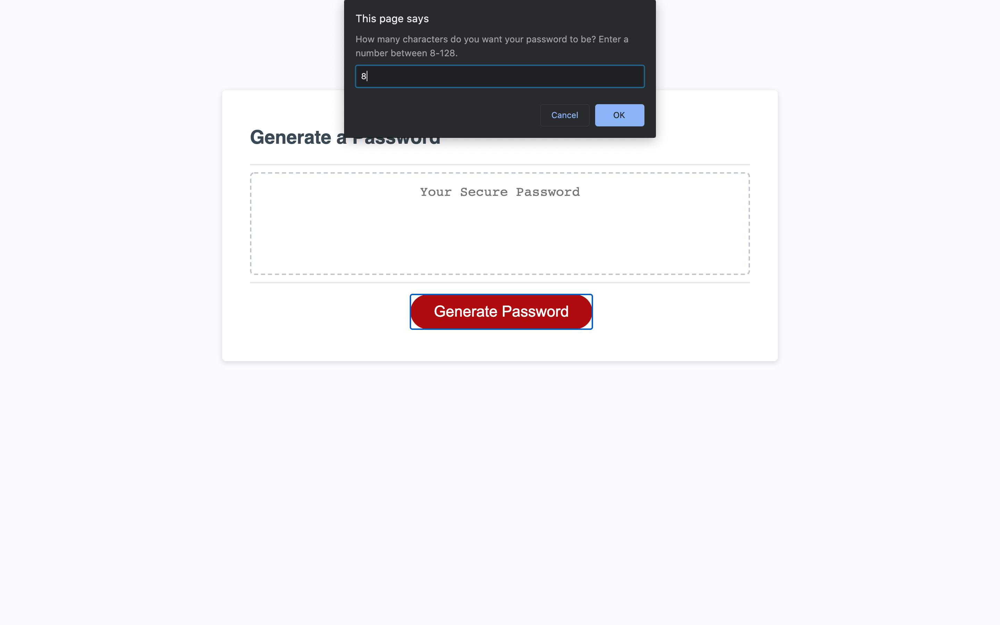
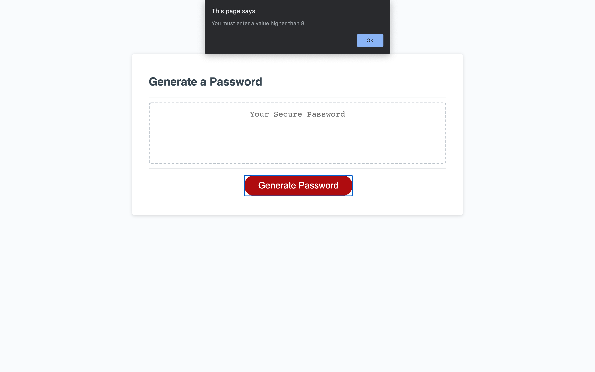
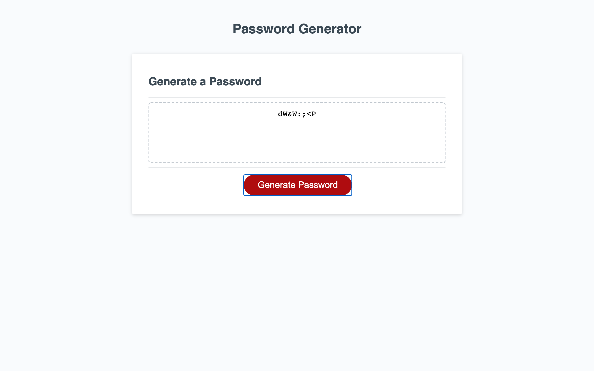

# Password-Generator
#Description
For our homework assignment, we needed to create a password generator using javaScipt. Upon clicking a button, the user is prompted to enter criteria for their password. The user can select any of the following criteria:
- Password length(Must be between 8 and 128 characters)
- Lower case letters: a-z
- Upper case letters: A-Z
- Numbers: 0-9
- Special characters: "!#$%&\()*+,-./:;<=>?@^[\\]^_`{|}~"

If the user does not specify the criteria or if the password length is not within bounds, the program does not run.
If the user correctly enters their criteria, a random password will be generated and displayed in the text box.

##Usage

Live website: https://ericlafontsee.github.io/Password-Generator/

## Built With
HTML  
CSS  
JavaScript  

## Installation
No outside software or frameworks required.

## Author
Eric LaFontsee - JavaScript
Trilogy - HTML and CSS

## License
MIT License

## Acknowledgments
Anthony Cooper(Instructor) - For help with revisions and debugging of the javaScript.